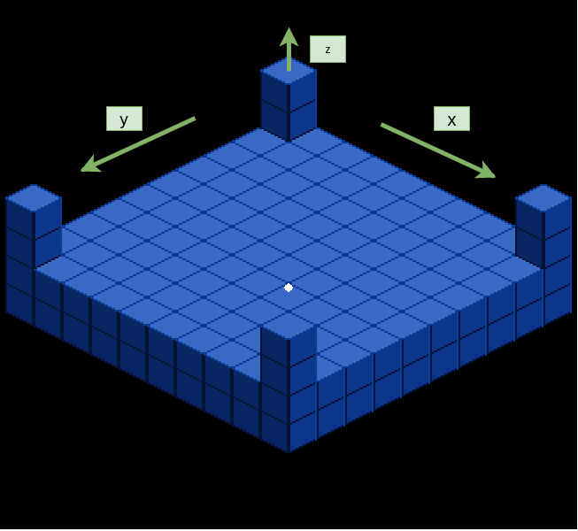

# Client

## Installation
The Client can be installed manually or using docker.

### Docker
Build the docker container `soprateam17/client` with
```bash
make build
```
or pull the prebuilt container for the `develop` branch from dockerhub:
```bash
docker pull soprateam17/client
```

Run the container with
```
make run
```

### Manual installation
#### Prerequisites
* Ubuntu 18.04
* python 3.6 / 3.7
* virtualenv / pip
* CMake (at least version 3.10)
* GNU-Make

#### Installing the C++-Libs
To install the C++ Libs run
```
./installCppLibs.sh
```
This will install all needed dependencies and will install die *libSopra_* under `/usr/local/lib`.

#### Installing python dependencies
By running 
```
pip install -r requirements.txt
```
all python dependencies are installed.

## Usage
To start the Client, execute
```
python3 run.py
```

## Isometric View

### Koordinaten System
Die Koordinaten sind folgendermaßen definiert.  



Transformation von World-Koordinaten zu View-Koordinaten:  
Hierbei bezeichnet
* v : View-Koordinaten
* b : Breite der Tiles
* h : Höhe der Tiles
* x,y,z : World-Koordinaten
* m : Mittelpunkt des screens, verschieben des Spielfeldes in Mitte


## Using C++ lib in Python
Angenommen unsere C++ lib heißt CppLib und besitzt die Header-Dateien CppLibHeaedrN.hpp (N: fortlaufende Nummer). In den Header-Dateien ist jeweils eine Klasse CppLibClassN implementiert.

### get cppyy
`pip install cppyy`

### get the C++ lib
C++ lib muss installiert werden, sollte also mit in die Dependencies.
Vermutlich kann man die C++ lib auch als Submodule verwenden, allerdings muss diese dann irgendwie im Rahmen des Python-Projekts gebildet werden (noch nicht ausprobiert).

### "import" C++ lib to your project
Hierzu muss kein make File oder dergleichen erstellt werden. Analog zu `import X` muss folgendes gemacht werden:

#### C++ lib ist auf dem Gerät installiert
```
# do this for every C++ lib you want to use
cppyy.load_library('CppLib')
# include only header files needed
cppyy.include('CppLib/CppLibHeader1.hpp')
...
cppyy.include('CppLib/CppLibHeaderN.hpp')
```
Analogon zu C++: `cppyy.load_library('CppLib')` entspricht in C++ `target_link_libraries(${PROJECT_NAME} CppLib)` im CMakeLists.txt File. `cppyy.include('CppLib/CppLibHeader1.hpp')` entspricht in C++ `#include <CppLib/CppLibHeaderN.hpp>`

#### C++ lib als Teil des Projekts (submodule, nicht installiert)
```
# do this for every C++ lib you want to use
cppyy.add_include_path('<path to CppLib>')
# include only header/code files needed
cppyy.include('<path to CppLib>/CppLibHeader1.hpp')
cppyy.include('<path to CppLib>/CppLibHeader1.cpp')
...
cppyy.include('<path to CppLib>/CppLibHeaderN.hpp')
cppyy.include('<path to CppLib>/CppLibHeaderN.cpp')
```
### use C++ lib in your project after "importing"
#### Klasse instanizieren und mit ihr arbeiten
```
# Instanz einer Klasse erstellen -> als wäre es eine Python Klasse, abgesehen von dem vorangestellten cppyy.gbl.
object_n = cppyy.gbl.CppLibClassN(<paramerters here>)
# Methode einer instantiierten Klasse aufrufen -> als wäre es eine Python Klasse
object_n.doSometing(<paramerters here>)
# Parameter einer instantiierten Klasse ansprechen -> als wäre es eine Python Klasse
object_n.parameter
```

#### Python Klasse erstellen, die von Klasse aus C++ lib erbt (wird hier für Callback aus LibClient benötigt werden)
Damit der Beispielcode unten funktioniert muss `CppLibClassN` einen default Konstruktor und einen virtuellen default Destruktor besitzen.
```
class PythonClassN(cppyy.gbl.CppLibClassN):
    def __init__(self):
        # setting parameters from C++ lib types does not work here !
        pass
    def init_cpp_types():
        # set C++ lib parameters for class in extra method that has to be called manually after __init__()
        self.object_n = cppyy.gbl.CppLibClassN(<paramerters here>)
    def some_other_method(<paramerters here>):
        # note: parameters have to be Python types, so you cannot use types from the C++ lib as parameter
        ...
    ...
```
Besitzt `CppLibClassN` virtuelle Methoden (entspricht abstrakten Methoden in Java) müssen diese in `PythonClassN` implementiert werden.


### useful links
[official website](https://cppyy.readthedocs.io/en/latest/)

[official pdf documentation](https://readthedocs.org/projects/cppyy/downloads/pdf/latest/)

